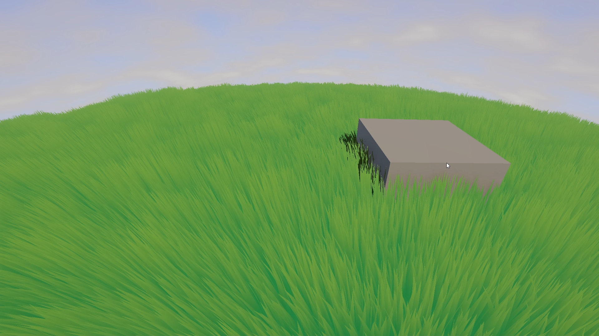

# Gazon
Casual relaxing rhythm game with a piano in the middle of the field that controls the weather
>[!NOTE]
>Project is in progress on start stage

### Done:
- Endless chunks system
- Biomes system with 2 biomes, each with different weather properties
- Weather change system with the example of wind
- Grass, terrain and round world shaders
- Player movement
- Playable piano with 88 keys

### Demo video
[](https://drive.google.com/file/d/1XbOMAG58Nsbwd79SWd65S3FjyNlXy6m9/view?usp=drive_link)


## Project settings
```
Unity version - 6000.2.6f2
Render pipline - URP
```

## Folding
- :open_file_folder:Assets
  - :open_file_folder:_Presentation   `visual assets and configs`
    - :open_file_folder: Animations
    - :open_file_folder: Audio
    - :open_file_folder: Fonts
    - :open_file_folder: Models
    - :open_file_folder: Prefabs
    - :open_file_folder: Resources
    - :open_file_folder: Textures
    - ...
  - :open_file_folder:_Source  `game scripts`
    - :open_file_folder:Editor
    - :open_file_folder:Runtime
      - :open_file_folder:Configs
      - :open_file_folder:Features `business logic`
      - :open_file_folder:Systems `modules of systems with game mechanics`
      - :open_file_folder:Utils
    - ...
  - :open_file_folder:_Support `Plugins and 3d party assets`
    - :open_file_folder:TextMeshPro
    - :open_file_folder:Plugins
    - ...
